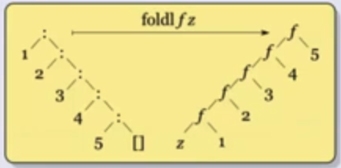

# Esquemas de recursión

## Esquemas de recursión sobre listas

### Recursión estructural

Pensemos un par de funciones sobre listas:

- `sumaL`: la suma de todos los valores de una lista de enteros

    ```haskell
    -- alguna def con tipos
    sumaL [] = 0
    sumaL (x:xs) = x + sumaL(xs)
    ```
- `concat`: la concatenación de todos los elementos de una lista de listas

    ```haskell
    -- alguna def con tipos
    concat [] = []
    concat (x:xs) = x ++ concat xs
    ```
- `reverso`: el reverso de una lista

    ```haskell
    reverso [] = []
    reverso (x:xs) = reverso xs ++ [x]
    ```

~~~admonish info title="Generalizando..."

**El approach es siempre el mismo**. Asumo que se calcular el resultado para el
caso más chico y hago alguna operación para combinar todo, y el resultado puede
ser otra cosa distinta, no necesariamente una lista. Sumado a eso tenemos un
caso base distinguido.

```haskell
g :: [a] -> b
-- caso base distinguido
g [] = z
g (x:xs) = f x (g xs)
```

Generalizando, obtenemos el fold:


```haskell
-- recibimos una función, un elemento para el caso base y una lista
-- la función recibe un elemnto de la lista, y lo otro de tipo b es el resultado parcial
foldr :: (a -> b -> b) -> b -> [a] -> b
foldr _ z [] = z
foldr f z (x:xs) = f x (foldr f z xs)
```

~~~

#### Algunos ejemplos con `foldr`

Podemos repensar las funciones de antes usando `foldr`:

```haskell
-- a = b = Int => (+) :: Int -> Int -> Int === a -> b -> b
sumaL = foldr (+) 0
-- a = b = [a'] => (++) :: [a'] -> [a'] -> [a'] === a -> b -> b
concat = foldr (++) []
-- a = a', b = [a'] => (:) :: a' -> [a'] -> [a'] === a -> b -> b
-- flip toma una función de 2 parámetros y les invierte el orden
-- al componerlo con (:[]) lo que hace es al primer parámetro (a')
-- lo mete en la lista vacía. Luego se pasa a flip (++) que va a 
-- hacer el ++ usando el primer parámetro como segundo
reverso = foldr ((flip (++)) . (:[])) []
-- alternativa más legible en mi opinión
reverso = foldr (\elem -> \partial -> partial ++ [elem]) []
```

Y también podemos reimplementar `map` y `filter` usando `foldr`:

```haskell
map f = foldr (\elem -> \partial -> (f elem):partial) []
-- alternativa: (:) es una función a -> [a] -> [a]. 
-- La compongo con f (sobre el primer elemento) y gané
-- map f = foldr ((:) . f) []
filter f = foldr (\elem -> \partial -> if f elem then (elem:partial) else partial) []
```

Podemos implementar `(++)` usando `foldr`?

```haskell
(++) :: [a] -> [a] -> [a]
xs ++ ys = foldr (:) ys xs
```

Ahora probemos algo más complicado. Definamos `sumaLong` que calcula la
longitud y la suma en una únca pasada sobre una lista.

```haskell
sumaLong :: [Int] -> (Int, Int)
-- hago pattern matching contra una tupla
sumaLong = foldr (\elem -> \(recLong, recSum) -> (recLong + elem, recSum + 1)) (0, 0)
```

Por último, podemos definir `dropWhile` usando foldr? Ej de uso: `dropWhile
even [2, 4, 1, 6] = [1, 6]`. La definición "clásica" es:

```haskell
dropWhile :: (a -> Bool) -> [a] -> [a]
dropWhile _ [] = []
dropWhile p (x:xs) = if p x then dropWhile p xs else x:xs
```

La intuición me dice de que esto no se va a poder, porque ahora no tenemos el
final de la recursión cuando se nos acaba la lista, si no que depende de los
elementos. Igual intentemos:

```haskell
dropWhile = foldr (\x rec -> ????????) []
```

Tengo un problema... Si justo tenía que cortar en `x`, no tengo forma de
"decirle" al caso recursivo que no tiene que filtrar, y tampoco tengo cómo
recuperar lo que falta de la lista. 

Cómo puedo sobreponerme a esto? Bueno, por algo vimos el ejemplo anterior de
`SumaLong`. Podría hacer que mi función devuelva una tupla, en donde el primer
elemento es el resultado del `dropWhile` y el segundo es la lista sin filtrar.

```haskell
dropWhile p = fst (foldr (\x (droppedRec, undroppedRec) -> 
        if p x then (undroppedRec, x:undroppedRec) 
        else (x:droppedRec, x:undroppedRec)) ([], []))
-- alternativa
dropWhile p = fst (foldr (\x (droppedRec, undroppedRec) -> 
        (if p x then undroppedRec else x:droppedRec, x:undroppedRec)) ([], []))
-- alternativa: llamo a lo de arriba sin el fst dropWhileTupla y después dropWhile p xs = fst (dropWhileTupla p xs)
```

### Recursión Primitiva

Tomando este problema que tuvimos con `foldr` para implementar `dropWhile`, por
qué no nos definimos otra función que si tenga en cuenta el `xs` del resto de
la lista?

El esquema de `dropWhile` sería:

```haskell
g :: [a] -> b
-- caso base
g [] = z
-- recursión
g (x:xs) = f x xs (g xs)
```

Y la generalización la llamamos `recr`:

```haskell
recr :: b -> (a -> [a] -> b -> b) -> [a] -> b
recr z _ [] = z
recr z f (x:xs) = f x xs (recr z f xs)
```

~~~admonish info title="Sobre funciones Primitivas Recursivas"

Las funciones Primitivas Recursivas son un conjunto de funciones que vemos en
Lógica y Computabilidad, y en particular tienen un esquema de recursión muy
parecido a este que acabamos de ver. Dicho eso, sabemos que no son todas las 
funciones computables debido a que por ejemplo [no existe una primitiva recursiva que pueda calcular la función de Ackermann](https://planetmath.org/ackermannfunctionisnotprimitiverecursive).

Sin embargo, es posible con `foldr` implementar la función de Ackermann. Esto
da cuenta realmente del poder de expresividad de `foldr`.

~~~

Podemos reimplementar `dropWhile` usando `recr`?

```haskell
dropWhile p = recr [] (\x xs rec -> if p x then xs else x:rec)
```

Mucho más simple!

Podemos escribir `foldr` usando `recr`?

```haskell
foldr f z = recr z (\x xs rec -> f x rec)
```

Y `recr` en términos de `foldr`?

```haskell
-- Uso el mismo truco de antes, devuelvo la tupla manteniendo en el segundo elemento
recr z f = fst . (foldr (\x (rec, xs) -> (f x xs rec, x:xs)) (z, []))
```

~~~admonish info title="foldl"

Una alternativa a `foldr :: (a -> b -> b) -> b -> [a] -> b` es `foldl` (notar
que se invierte el orden de los tipos en la función):

```haskell
foldl :: (b -> a -> b) -> b -> [a] -> b
foldl _ z [] = z
foldl f z (x:xs) = foldl f (f z x) xs
```

La lista ahora se "recorre" de adelante hacia atrás:



Otro detalle es que ahora el llamado recursivo no es parte de la `f`. Si
volvemos a revisar `foldr` vamos a notar que si `xs` era una lista infinita,
pero `f` ignora la lista no pasa nada. En cambio acá si tenés problemas porque
se consume la lista entera incluso si `f` no la usa.

Notar que en `foldl` el `z` es el resultado parcial, no el caso base (o más
bien, es el caso base en el primer elemento y después es el resultado parcial
acumulado).

Si queremos ver un ejemplo, tomemos `sumaL`:

```haskell
sumaL = foldl (+) 0
```

Es igual! Pero el orden de evaluación cambia:

```haskell
foldl (+) 0 [1, 2]
foldl (+) ((+) 0 1) [2]
foldl (+) ((+) ((+) 0 1) 2) []
((+) ((+) 0 1) 2)
((+) 1 2)
3
```

Otro ejemplo, el reverse!:

```haskell
reverse = foldl (\acc x -> x:acc) []
-- equivalentemente
reverse = foldl (flip (:)) []
```

~~~

### `foldl` vs `foldr`

- En listas infinitas? Usá `foldr`
- Puedo escribir `foldl` usando `foldr`?

```haskell
-- galerazo: en lugar de acumular y listo, devuelvo una función 
-- que cuando la aplique va a tomar el orden del foldl (asumamos 
-- que g es alguna función que toma un elemento)
foldl f z xs = foldr (\x recf -> (\ac -> recf (f ac x))) (g) 
```

Creo que ayuda más a entender si lo vemos con un ejemplo y lo expandimos:

```haskell
-- supongamos que hacemos foldl f g [x, y]
-- al final de la recursión tenemos:
(\ac -> g (f ac y))
-- cuando se vuelve de la recursión y se aplica el siguiente paso
(\ac' -> (\ac -> g (f ac y)) (f ac' x))
-- Si hacemos el reemplazo en la evaluación:
(\ac' -> g (f (f ac' x) y))
-- ahí se puede ver que si ac' es el caso base z, tendría la evaluación en el orden del foldl
```

Por último entonces, alcanza con notar que si `g = id` ya gané. O sea que queda definida como:

```haskell
foldl f z xs = foldr (\x recf -> (\ac -> recf (f ac x))) id z
```

- Puedo escribir `foldr` usando `foldl`? No, pero si para listas finitas

# Esquemas de recursión sobre tipos de datos algebráicos

## Árboles binarios

Recuerdo, yo podía definir un árbol binario como:

```haskell
data Arbol a = Hoja a | Nodo a (Arbol a) (Arbol a)
```

Y podría querer por ejemplo aplicar una función a todos los nodos. A qué te
suena eso? Así es, al `map`. En el caso de árboles tendríamos un `map` definido
como:

```haskell
mapA :: (a -> b) -> Arbol a -> Arbol b
mapA f (Hoja x) = Hoja (f x)
mapA f (Nodo a (sai) (sad)) = (Nodo (f a) (mapA f sai) (mapA f sad))
```

Así como puedo hacer `map`, puedo hacer `fold` también:

```haskell
-- recibo una función para aplicar en el caso base y otra 
-- para la combinación. La segunda recibe los resultados del
-- fold para ambas ramas
foldA :: (a -> b) -> (a -> b -> b -> b) -> Arbol a -> b
foldA f g (Hoja x) = f x
foldA f g (Nodo x izq der) = g x (foldA f g izq) (foldA f g der)
```

### Algunas operaciones interesantes

```haskell
-- no te suena al foldr (:) = id?
-- obs: fold aplicado a los constructores es la identidad
id = foldA Hoja Nodo

sumaA = foldA id (\x izq der -> x + izq + der)

altura = fold (\x -> 1) (\x izq der -> max izq der + 1)
```

## Árboles Generales

```haskell
data AG a = NodoAG a [AG a]
```

La pregunta es cómo hago `fold`/`map` con esto?

```haskell
mapAG :: (a -> b) -> AG a -> AG b
-- uso tanto map como mapAG!!!
mapAG f (NodoAG a as) = NodoAG (f a) (map (mapAG f) as)
```

```haskell
-- No tengo "caso base" porque map _ [] = []. 
-- Ya está implícito el caso base
foldAG :: (a -> [b] -> b) -> AG a -> b
-- notar que es igual a antes, pero en lugar de aplicar al nodo 
-- izquierdo o derecho lo aplico a todos los nodos de la lista
foldAG f (NodoAG a as) = f a (map (foldAG f) as)
```

