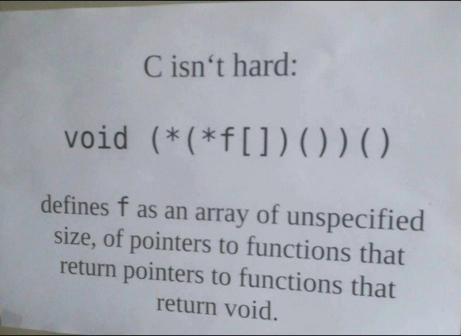

$$
   \newcommand{\lcb}{\lambda^b}
   \newcommand{\lce}{\lambda^{bn}}
   \newcommand{\lcr}{\lambda^{\dots n}}
   \newcommand{\lcu}{\lambda^{bnu}}
   \newcommand{\lclet}{\lambda^{\dots let}}
   \newcommand{\ifLC}[3]{if\  {#1}\  then\  {#2}\  else\  {#3}}
   \newcommand{\lf}[3]{\lambda{#1}:\ {#2}.{#3}}
   \newcommand{\apply}[2]{{#1}\ {#2}}
   \newcommand{\hastype}[3]{{#1} \triangleright {#2}: {#3}}
   \newcommand{\tzero}[1]{\frac{}{\hastype{\Gamma}{0}{Nat}}  (T-Zero)}
   \newcommand{\tsucc}[2]{\frac{\hastype{#1}{#2}{Nat}}{\hastype{\Gamma}{succ(M)}{Nat}}  (T-Succ)}
   \newcommand{\tpred}[2]{\frac{\hastype{#1}{#2}{Nat}}{\hastype{\Gamma}{pred(M)}{Nat}}  (T-Pred)}
   \newcommand{\tiszero}[2]{\frac{\hastype{#1}{#2}{Nat}}{\hastype{\Gamma}{iszero(M)}{Bool}}  (T-IsZero)}
   \newcommand{\esucc}[2]{\frac{#1 \rightarrow #2}{succ(#1) \rightarrow succ(#2)} (E-Succ)}
   \newcommand{\epredzero}{\frac{}{pred(0) \rightarrow 0} (E-PredZero)}
   \newcommand{\epredsucc}[1]{\frac{}{pred(#1 + 1) \rightarrow #1} (E-PredSucc)}
   \newcommand{\epred}[2]{\frac{#1 \rightarrow #2}{pred(#1) \rightarrow pred(#2)} (E-Pred)}
   \newcommand{\eiszerozero}{\frac{}{iszero(0) \rightarrow true} (E-IsZeroZero)}
   \newcommand{\eiszerosucc}{\frac{}{iszero(n + 1) \rightarrow false} (E-IsZeroSucc)}
   \newcommand{\eiszero}[2]{\frac{#1 \rightarrow #2}{iszero(#1) \rightarrow iszero(#2)} (E-IsZero)}
$$
# Cálculo Lambda Tipado Extendido \\(\lce\\)

Idea: extendamos \\(lcb\\) para agregar los números naturales y así darle mayor utilidad.

> Nota: esta idea de extender el lenguaje es interesante más allá de lo
> teórico, en la práctica si uno quiere agregar un feature a un lenguaje tiene
> que considerar qué pasos son necesarios para extenderlo.

## Tipos y Términos de \\(\lce\\)

Los tipos son:

$$
\sigma ::= Bool\ Nat\ \sigma \rightarrow \rho
$$

Y los términos son:

$$
M ::= \dots | 0 | succ(M) | pred(M) | iszero(M)
$$

donde tengo los términos del \\(lcb\\) usual más los aquí definidos:

- \\(succ(M)\\): evaluar \\(M\\) hasta que de un número e incrementarlo.
- \\(pred(M)\\): evaluar \\(M\\) hasta que de un número y decrementarlo.
- \\(iszero(M)\\): evaluar \\(M\\) hasta que de un número y luego devolver \\(true / false\\) según sea cero o no.

## Reglas de tipado de \\(lce\\)

Junto con las reglas y axiomas previamente definidas para \\(lcb\\), se le suman:

$$
\tzero{\Gamma}
$$

$$
\tsucc{\Gamma}{M}
$$

$$
\tpred{\Gamma}{M}
$$

$$
\tiszero{\Gamma}{M}
$$

## Valores \\(\lce\\)

Valores:

$$
V ::= \dots |\ n\ \text{ donde n abrevia } succ^n(0)
$$

Esto ya nos da una idea de que si tengo un \\(succ(M)\\) voy a querer reducir lo de adentro tanto como pueda

## Juicio de evaluación en un paso

Ahora le damos la semántica. Igual que para el tipado, usamos las mismas reglas que antes sumando:

- Para succ y pred:

$$
\esucc{M_1}{M_1'}
$$

$$
\epredzero
$$

$$
\epredsucc{n}
$$

$$
\epred{M_1}{M_1'}
$$

- Para iszero:

$$
\eiszerozero
$$

$$
\eiszerosucc
$$

$$
\eiszero{M_1}{M_1'}
$$

> Algunas observaciones:
>
> - Tanto \\(E-Succ\\) y \\(E-Pred\\) intentan reducir el argumento hasta llevarlo a un valor
> - pred además reduce cuando tiene adentro un succ (a pesar de estar en forma normal)
> - iszero reduce hasta tener un valor y después hace el chequeo

# Cálculo Lambda Tipado Extendido \\(\lcr\\)

## Tipos

Podemos pensar a los registros como un struct de C ponele. Incluso más simple,
es un conjunto de tuplas **ordenado** (nombre, valor).

Para suponemos que tenemos \\(\mathcal{L}\\) un conjunto de etiquetas y sumamos el nuevo tipo:

$$
\sigma ::= \dots |\ \\{l_i : \sigma_i^{i \in 1 \dots n}\\}
$$

> Observación: los registros pueden tener subregistros adentro. Por ejemplo:

## Términos

$$
M ::= \dots |\ \\{l_i = M_i^{i \in 1 \dots n}\\} |\ M.I
$$

Informalmente hablando:

- El registro \\(\\{l_i = M_i^{i \in 1 \dots n}\\}\\) evalúa a \\(\\{l_i = V_i^{i \in 1 \dots n}\\}\\), donde \\(V_i\\) es el valor al que evalúa \\(M_i\\), \\(i \in 1 \dots n\\).
- \\(M.I\\), la proyección, consiste en evaluar \\(M\\) hasta obtener \\(\\{l_i = V_i^{i \in 1 \dots n}\\}\\) y luego proyectar al campo correspondiente.

Algunos ejemplos:


1. Dado un \\(x\\) de tipo \\(Nat\\) y un \\(y\\) de tipo \\(Bool\\), genera un registro donde pongo en \\(edad\\) a \\(x\\) y en \\(esMujer\\) a \\(y\\).
2. Dado un registro que tiene 2 campos, aplica la proyección del campo \\(edad\\)
3. Este último es igual al anterior pero se evalúa en lugar de obtener una función y listo

## Reglas de tipado

$$
\frac{\Gamma \triangleright M_i : \sigma_i\ \text{para cada } i \in 1 \dots n}{\Gamma \triangleright \\{l_i = M_i^{i \in 1 \dots n} \\} : \\{l_i : \sigma_i^{i \in 1 \dots n}\\}} (T-RCD)
$$

$$
\frac{\Gamma \triangleright M_i : \\{l_i : \sigma_i^{i \in 1 \dots n}\\}\ j \in 1 \dots n}{\Gamma \triangleright M.I_j : \sigma_j} (T-Proj)
$$

## Semántica operacional de \\(lcr\\)

### Valores

Agrego los registros como posibles valores (en tanto todos sus elementos sean valores también):

$$
V ::= \dots |\ \\{l_i = V_i^{i \in 1 \dots n}\\}
$$

### Reglas de reducción

La primer regla nos da la idea de que sí o si tengo que reducir en el orden de las etiquetas:

$$
\frac{M_j \rightarrow M_j'}{\\{l_i = V_i^{i \in 1 \dots j-1}, l_j = M_j, l_i = M_i^{i \in j+1 \dots n}\\} \rightarrow \\{l_i = V_i^{i \in 1 \dots j-1}, l_j = M_j', l_i = M_i^{i \in j+1 \dots n}\\}} (E-RCD)
$$

Luego tenemos las reglas para la proyección:

$$
\frac{j \in 1 \dots n}{\\{l_i = V_i^{i \in 1 \dots n}\\}.l_j \rightarrow V_j} (E-ProjRCD)
$$

$$
\frac{M \rightarrow M'}{M.I \rightarrow M'.I} (E-ProjRCD)
$$

O sea que primero reduzco antes de proyectar, y reduzco en el orden de las
etiquetas. Una vez que llegué a una expresión de registro en forma normal,
recién ahí hago el reemplazo por el valor correspondiente a la etiqueta.

# Cálculo Lambda Tipado Extendido \\(\lcu\\)

Vamos a agregar un nuevo tipo, que se va a comportar similar a lo que es el void en C o C++. A este tipo lo vamos a llamar \\(Unit\\). No nos importa mucho qué retorna.

## Tipos y términos de \\(\lcu\\)

$$
\sigma ::= Bool\ |\ Nat\ |\ \textbf{Unit}\ |\ \sigma \rightarrow \rho
$$

$$
M ::= \dots\ |\ unit
$$

## Reglas de tipado

Se agrega un axioma de tipado:

$$
\frac{}{\hastype{\Gamma}{unit}{Unit}}
$$

> Observaciones:
> - no se agregan reglas de evaluación nuevas
> - Se extiende el conjunto de valores \\(V\\) con \\(unit\\):
> $$
> V ::= \dots\ |\ unit
> $$

## Utilidad de Unit

- El principal uso es en lenguajes que tienen side effects.
- En dichos lenguajes es útil poder evaluar varias expresiones secuencialmente. Entonces definimos:

$$
M_1;M_2 \stackrel{def}{=} \apply{(\lf{x}{Unit}{M_2})}{M_1}\ \ \ x \notin FV(M_2)
$$

- La evaluación de \\(M_1;M_2\\) consiste en nprimero evaluar \\(M_1\\) y luego \\(M_2\\).
- Bajo esta definición, el comportamiento se da con las reglas de evaluación ya existentes.

> *Obs*: por ahora nuestro lenguaje no tiene side effects, ya vamos a llegar a eso.

# Cálculo Lambda Tipado Extendido \\(\lclet\\)

En este caso, vamos a agregar una feature que no introduce tipos, y tampoco
introduce mecanismos de ejecución necesariamente pero si aporta legibilidad. Es
el equivalente en cálculo lambda del `f = ... where ...` de haskell.

## Términos

$$
M ::= \dots\ |\ let\ x : \sigma = M\ in\ N
$$

La idea es evaluar \\(M\\) hasta un valor \\(V\\), ligamos \\(x\\) a \\(V\\) y evaluamos \\(N\\). Algunos ejemplos:

- `let x: Nat = 2 in succ(x)`
- `pred (let x: Nat = 2 in x)`
- `let f: Nat -> Nat = \x: Nat.succ(n) in f(f(0))`
- `let x: Nat = 2 in let x: Nat = 3 in x`

## Tipado

Si bien no agregamos tipos, si tenemos una regla de tipado:

$$
\frac{\hastype{\Gamma}{M}{\sigma_1}\ \ \ \hastype{\Gamma,\ x:\sigma_1}{N}{\sigma_2}}{\hastype{\Gamma}{let\ x: \sigma_1 = M\ in\ N}{\sigma_2}} (T-Let)
$$

> **Obs**: la regla tiene un aire a \\(T-Abs\\) 

## Semántica operacional de \\(\lclet\\)

Tenemos 2 reglas, una para reducir y otra cuando llego a un valor:

$$
\frac{M_1 \rightarrow M_1'}{let\ x: \sigma = M_1\ in\ M_2 \rightarrow let\ x: \sigma = M_1'\ in\ M_2} (E-Let)
$$

$$
\frac{}{let\ x: \sigma = V_1\ in\ M_2 \rightarrow \apply{M_2}{\\{x \leftarrow V_1\\}}} (E-LetV)
$$

## Interpretando el `let`

En una expresión como `let x: Nat = 2 in M`:

- x se declara con el valor 2
- x es inalterado a lo largo de la evaluación de M
- en este sentido x es **inmutable**. No hay operación de asignación

Lo siguiente es agregar variables **mutables** (casi que estamos saliendo del terreno del lenguaje funcional y metiéndonos en el terreno del lenguaje mutable)

# Cálculo Lambda con variables mutables

Vamos a agregar algunas operaciones básicas:

- Reserva de memoria (allocation): \\(ref M\\) genera una referencia fresca cuyo contenido es el valor de \\(M\\).
- Desreferenciación (lectura): \\(!x\\) sigue la referencia \\(x\\) y retorna su contenido.
- Asignación: \\(x := M\\) almacena en la referencia \\(x\\) el valor de \\(M\\).

~~~admonish example title="Algunos Ejemplos"

(Nota: se omiten los tipos de las expreciones para facilitar la lectura, perdemos algo de formalismo. Sepan comprender)

- `let x = ref 2 in !x` evalúa a 2
- `let x = ref 2 in (\_: Unit.!x) (x := succ(!x))` evalúa a 3 (es lo mismo que
  hacer `x := succ(!x); !x`)
- `let x = 2 in x` evalúa a 2
- `let x = ref 2 in x` a qué evalúa? A priori no sabemos (todavía no vimos qué
  devuelve un `ref 2`)
- `let x = ref 2 in let y = x in (\_: Unit.!x) (y := succ(!y))` evalúa a 3.
  Primero reemplaza el y por la referencia, y después es igual al segundo
  ejemplo. Obtuve en este caso un alias a la celda de memoria.

**Obs**: x sigue **siendo inmutable** pero en los primeros 2 casos lo que es inmutable es la referencia a la memoria, no su contenido.

~~~

## Comandos

Pregunta: el término `let x = ref 2 in x := succ(!x)`, a qué evalúa? En la operación de asignación sólo interesa el efecto que tiene, por lo tanto la definimos como que evalúa a \\(unit\\). Esto es lo que conocemos como **comando**

## Formalizando

### Expresiones de tipos

<div style="float:right;margin-left:2rem;margin-bottom:1rem;margin-top:-6rem;width:330px">

~~~admonish success title="Achievement Unlocked"

Wow, ya desbloqueamos los punteros a funciones!



~~~

</div>

\\(Ref \sigma\\) va a ser el tipo de las referencias a valores de tipo \\(\sigma\\). O sea \\(Ref (Bool \rightarrow Nat)\\) es el tipo de las referencias a funciones de \\(Bool\\) en \\(Nat\\).

$$
\sigma ::= Bool\ |\ Nat\ |\ \sigma \rightarrow \tau\ |\ Unit\ |\ Ref \sigma
$$

### Términos

$$
M ::= \dots\ |\ ref\ M\ |\ !M\ |\ M := N\ |\ l
$$

<div style="width:330px">

> Nota: por ahora ignorar el último término pero es el que corresponde a las
> referencias propiamente dichas (idealemente no se exponen al "programador"
> pero en la maquinaria lógica hay que tenerlas en consideración)

</div>

### Reglas de tipado

El tipo de la referencia es una referencia al tipo del término:

$$
\frac{\hastype{\Gamma}{M_1}{\sigma}}{\hastype{\Gamma}{ref\ M_1}{Ref\ \sigma}} (T-Ref)
$$

El tipo de la desreferencia es el tipo interno de la referencia:

$$
\frac{\hastype{\Gamma}{M_1}{Ref\ \sigma}}{\hastype{\Gamma}{!M_1}{\sigma}} (T-DeRef)
$$

Por último, el tipo de una asignación es siempre unit y además el tipo de la variabla tiene que ser una referencia del tipo que se está asignando:

$$
\frac{\hastype{\Gamma}{M_1}{Ref\ \sigma_1}\ \ \hastype{\Gamma}{M_2}{\sigma_1}}{\hastype{\Gamma}{M_1 := M_2}{Unit}} (T-Assign)
$$

### Semántica

Al intentar formalizar la semántica operacional surgen 2 preguntas:

- Cuáles son los valores de tipo \\(Ref \sigma\\)
- Cómo modelo la evaluación del término \\(ref M\\)

Para poder responder esto tenemos que responder antes a la pregunta: *qué es una referencia* (rta: es una abstracción de una porción de memoria que se encuentra en uso).

Entonces, vamos a tener que modelar la memoria!

- Usamos direcciones simbólicas o "locations" \\(l, l_i \in \mathcal{L}\\) para representar referencias.
- La memoria o store va a ser una función parcial de direcciones a valores (a.k.a un diccionario).
- Usamos \\(\mu, \mu'\\) para referirnos a stores
- Notación:
    - \\(\mu[l \rightarrow V]\\) es el store resultante de pisar \\(\mu(l)\\) con \\(V\\).
    - \\(\mu \oplus (l \rightarrow V)\\) es el store extendido resultante de ampliar \\(\mu\\) con una nueva asociación \\(l \rightarrow V\\) (asumiendo \\(l \notin Dom(\mu)\\), porque si no hubiese usado la sintáxis de arriba).
- Cambia también ligeramente la sintaxis de los juicios de valor:

$$
M\ |\ \mu \rightarrow M'\ |\ \mu'
$$

~~~admonish title="juicios de tipado"

Agregar las location nos obliga a agregar nuevas reglas de tipado. En particular, cuál sería el tipo de \\(\hastype{\Gamma}{l}{?}\\)?

- Depende de qué valores se almacenen en \\(l\\)
- Tengo un problema similar al de las variables libres
- Tenemos que introducir entonces un **contexto de tipado** para direcciones \\(\Sigma\\)

Nuevo formato de los juicios de tipado:

$$
\hastype{\Gamma | \Sigma}{M}{\sigma}
$$

Y Nueva regla de tipado:

$$
\frac{\Sigma(l) = \sigma}{\hastype{\Gamma | \Sigma}{l}{Ref \sigma}} (T-Loc)
$$

~~~

#### Valores

Además de los ya existentes, incluimos las direcciones al conjunto de valores:

$$
V ::= \dots\ |\ unit\ |\ \lf{x}{\sigma}{M}\ |\ l
$$

#### Operaciones de reducción en un paso

Reglas para ref:

$$
\frac{M_1\ |\ \mu \rightarrow M_1'\ |\ \mu' \rightarrow}{(ref\ M_1 | \mu) \rightarrow ref\ M_1' | \mu} (E-RefV)
$$

$$
\frac{l \notin Dom(\mu)}{(ref V\ | \mu) \rightarrow (l | \mu \oplus (l \rightarrow V))} (E-RefV)
$$

Reglas para la desreferenciación:

$$
\frac{M_1 | \mu \rightarrow M_1' | \mu'}{!M_1 | \mu \rightarrow !M_1' | \mu} (E-Deref)
$$

$$
\frac{\mu(l) = V}{!l | \mu \rightarrow V | u} (E-DerefLoc)
$$

Las reglas para la asignación:

Dejo evolucionar el lado de la etiqueta:

$$
\frac{M_1\ |\ \mu \rightarrow M_1'\ |\ \mu'}{M_1 := M_2\ |\ \mu \rightarrow M_1' := M_2\ |\ \mu' } (E-Assign1)
$$

Cuando llegué al valor evalúo lo que se asigna:

$$
\frac{M_2\ |\ \mu \rightarrow M_2'\ |\ \mu'}{V := M_2\ |\ \mu \rightarrow V := M_2'\ |\ \mu' } (E-Assign2)
$$

Por último, la evaluación se reduce a \\(unit\\),  pero la memoria se modifica:

$$
\frac{}{l := V\ |\ \mu \rightarrow unit\ |\ \mu[l \rightarrow V] } (E-Assign)
$$

## Revisitando reglas de evaluación viejas

Como ahora tenemos el store, tenemos que actualizar todas las reglas previas.
Veamos un par de ejemplos de la aplicación pero en general la regla es la misma
y lo único que hay que reflejar es si el store puede cambiar o no.


$$
\frac{M_1\ |\ \mu \rightarrow M_1'\ |\ \mu'}{\apply{M_1}{M_2}\ |\ \mu \rightarrow \apply{M_1'}{M_2}\ |\ \mu'} (E-App1)
$$


$$
\frac{M_2\ |\ \mu \rightarrow M_2'\ |\ \mu'}{\apply{V_1}{M_2}\ |\ \mu \rightarrow \apply{V_1}{M_2'}\ |\ \mu'} (E-App2)
$$

Notar que para cuando hacemos la aplicación, al ser un reemplazo sintáctico el store no cambia:

$$
\frac{}{\apply{(\lf{x}{\sigma}{M})}{V}\ |\ \mu \rightarrow M \\{x \leftarrow V\\}\ |\ \mu} (E-AppAbs)
$$

## The last crusade: Corrección de sistema de tipos

Como vimos para \\(\lcb\\), podíamos asegurar dos características que eran:

- progreso: si \\(M\\) es cerrado y bien tipado entonces o bien es un valor o
  se puede reducir a un término \\(M'\\)
- preservación: si \\(M\\) es de tipo \\(\sigma\\) bajo el contexto
  \\(\Gamma\\), y se reduce a otro término \\(N\\), entonces ese nuevo término
  también va a ser de tipo \\(\sigma\\). O sea que la reducción preserva tipos.

Tenemos que poder reformular estas propiedades en el marco del lambda cálculo
tipado con referencias (y registros y otras cosas, aunque lo relevante son las
referencias).

~~~admonish warning title="Primer intento"

Qué pasa con la siguiente formulación?

> Si \\(\hastype{\Gamma | \Sigma}{M}{\sigma}\\) y \\(M\ |\ \mu \rightarrow M'\ |\ \mu'\\) entonces \\(\hastype{\Gamma | \Sigma}{M'}{\sigma}\\)

El problema que tenemos con esto es que la semántica puede no respetar los tipos asumidos para las direcciones (o sea \\(\sigma\\))

Por ejemplo, supongamos que:

- \\(M = !l \\)
- \\(\Gamma = \emptyset \\)
- \\(\Sigma(l) = Nat \\)
- \\(\mu(l) = true \\)

Esto ya de por si es raro porque significaría que nuestro tipo dice que tenemos
un \\(Nat\\) pero guardamos un valor booleano. Pero bueno, no está restringido
en lo que enunciamos.

Observar que:

- \\(\hastype{\Gamma | \Sigma}{M}{Nat} \\) y
- \\(M\ |\ \mu \rightarrow true\ |\ \mu \\)
- pero \\(\hastype{\Gamma | \Sigma}{true}{Nat}\\) no vale

Lo importante es la **coordinación entre el contexto de tipado** \\(\Sigma\\) **y el valor en el store durante la evaluación** \\(\mu\\)

~~~

### Reformulando preservación

Tenemos que hablar de compatibilidad / coordinación entre el store y el
contexto de tipado para stores (se podría pensar que "tipamos" los stores).

Para eso intrducimos un nuevo "juicio de tiapdo" para el store:

$$
\Gamma | \Sigma \triangleright \mu \iff
$$

- \\(Dom(\Sigma) = Dom(\mu)\\)
- \\(\hastype{\Gamma | \Sigma}{\mu(l)}{\Sigma(l)} \text{ para todo } l \in Dom(\mu)\\)

Con esto definido, podemos reformular la propiedad de preservación:

> Si \\(\hastype{\Gamma | \Sigma}{M}{\sigma}\\) y \\(M\ |\ \mu \rightarrow N\ |\ \mu'\\) y \\(\Gamma | \Sigma \triangleright \mu\\) entonces \\(\hastype{\Gamma | \Sigma}{N}{\sigma}\\)

Pero de vuelta, tenemos que considerar una cosa más. En el paso de evaluación,
pudo haber cambiado el store. Entonces necesitamos también incluir dicha
consideración.


> Si 
>
> - \\(\hastype{\Gamma | \Sigma}{M}{\sigma}\\) 
> - \\(M\ |\ \mu \rightarrow N\ |\ \mu'\\) 
> - \\(\Gamma | \Sigma \triangleright \mu\\) 
>
> entonces existe un \\(\Sigma' \subseteq \Sigma\\) tal que:
>
> - \\(\hastype{\Gamma | \Sigma'}{N}{\sigma}\\)
> - \\(\Gamma\ |\ \Sigma' \triangleright \mu'\\)

### Reformulando progreso

Si \\(M\\) es cerrado y bien tipado (es decir, \\(\hastype{\emptyset | \Sigma}{M}{\sigma}\\)) para algún \Sigma,\sigma) entonces:

- \\(M\\) es un valor (o sea el store quedó fijo)
- o bien para cualquier store \\(\mu\\) tal que \\(\emptyset | \Sigma \rightarrow \mu\\), existe \\(M'\\) y \\(\mu'\\) tal que \\(M\ |\ \mu \rightarrow M'\ |\ \mu'\\) (o sea que puedo haber cambiado el store)

### Ejemplos


~~~admonish warning title="Opa Opa Opa..."

En ese último ejemplo me quedo en un loop infinito de evaluaciones. En
\\(\lambda^{bnr}\\) (lambda cálculo con booleanos, naturales y referencias) no
todo término cerrado y bien tipado termina.

~~~

## Recursión

Algo común en funcional es tener definiciones de funciones recursivas.
Intentemos extender el \\(\lambda\\)-cálculo para soportarlo. Para eso tenemos
que introducir un nuevo término:

$$
M ::= \dots\ |\ fix\ M
$$

Y si bien no se precisan nuevos tipos, si se necesita una regla de tipado nueva:

$$
\frac{\hastype{\Gamma}{M}{\sigma_1 \rightarrow \sigma_1}}{\hastype{\Gamma}{fix\ M}{\sigma_1}} (T-Fix)
$$

> Obs: sólo le puedo pasar funciones cuyo dominio y codominio coincidan, y \\(fix M\\) tiene el mismo tipo que el codominio.

### Semántica operacional

No hay valores nuevos pero se suman 2 reglas de evaluación.

> Nota: si bien es posible, acá dejamos de considerar la parte de cálculo
> lambda con efectos y referencias

Primero reduzco todo lo que pueda lo de adentro del fix

$$
\frac{M_1 \rightarrow M_1'}{fix\ M_1 \rightarrow fix\ M_1'} (E-Fix)
$$

Luego hago el reemplazo como cuando hacía la evaluación de una lambda. Pero ojo, **lo reemplazo por el fix entero**.

$$
\frac{}{fix\ \lf{x}{\sigma}{M} \rightarrow M \\{x \leftarrow fix\ \lf{x}{\sigma}{M}\\}} (E-FixBeta)
$$

### Mecanismo de escape

Dada la semántica operacional de \\(fix\\), se va a evaluar tanto como sea
necesario. Pero a priori puede seguir de forma infinita. Entonces necesitamos
alguna herramienta que nos de control respecto a cuándo cortar. Una posibilidad
es usar un if-else-then. Veamos un ejemplo de eso:

Sea M el término:

```
\f: Nat -> Nat. 
    \x: Nat. if iszero(x) then 1 else x * f(pred(x))
```

en

```
let fact = fix M in fact 3
```

Veamos cómo se reduce:

```
let fact = fix M in fact 3
let fact = \x: Nat. if iszero(x) then 1 else x * (fix M)(pred(x)) in fact 3
\x: Nat. if iszero(x) then 1 else x * (fix M)(pred(x)) 3
if iszero(3) then 1 else 3 * (fix M)(pred(3))
3 * (\x: Nat. if iszero(x) then 1 else x * (fix M)(pred(x)))(pred(3))
3 * (\x: Nat. if iszero(x) then 1 else x * (fix M)(pred(x)))(2)
3 * (if iszero(2) then 1 else 2 * (fix M)(pred(2))))
3 * (2 * (fix M)(pred(2)))
3 * (2 * (\x: Nat. if iszero(x) then 1 else x * (fix M)(pred(x)))(pred(2)))
3 * (2 * (\x: Nat. if iszero(x) then 1 else x * (fix M)(pred(x)))(1))
3 * (2 * iszero(1) then 1 else 1 * (fix M)(pred(1)))
3 * (2 * 1 * (fix M)(pred(1)))
3 * (2 * 1 * (fix M)(0))
3 * (2 * 1 * (\x: Nat. if iszero(x) then 1 else x * (fix M)(pred(x)))(0))
3 * (2 * 1 * if iszero(0) then 1 else 0 * (fix M)(pred(0)))
3 * (2 * 1 * 1)
...
6
```

Obs: el término M tiene tipo `(Nat->Nat) -> (Nat->Nat)`, con lo cual el fix va
a ser de tipo `Nat->Nat`. De alguna forma podemos pensar que la f sirve para
llamar a la recursión de la función y la x es el parámetro del llamado actual.

### Más ejemplos

- Podemos definir funciones parciales:

```
fix (\x: Nat.succ x) 
-> succ (fix (\x: Nat.succ x)) 
-> succ (succ (fix (\x: Nat.succ x)))
-> ...
```

## letrec

A modo de sintactic sugar definimos:

```
letrec f: t -> t = \x : t.M in N
```

El letrec se puede re-escribir usando let con:

```
let f = fix (\f : t -> t. \x: t.M) in N
```
