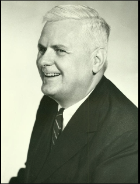

# Unidad 2 - Cálculo Lambda

- El Cálculo Lambda es un modelo de cómputo basado en **funciones**, que es la
  base para el paradigma funcional.
- Fue introducido por Alonzo Church en el 34', cuando quería responder a la
  pregunta de si había un proceso mecánico para demostrar si una fórmula era
  teorema o no.
  - Alonzo formalizó en el lambda cálculo esta idea de computar cosas.
- Si bien lo introduce en el 34', nosotros vamos a ver el **Cálculo Lambda Tipado**, también desarrollado por Church pero en el 41'.
    - las expresiones tienen tipos
- El lambda cálculo es también computacionalmente completo, a.k.a **Turing Completo**.
